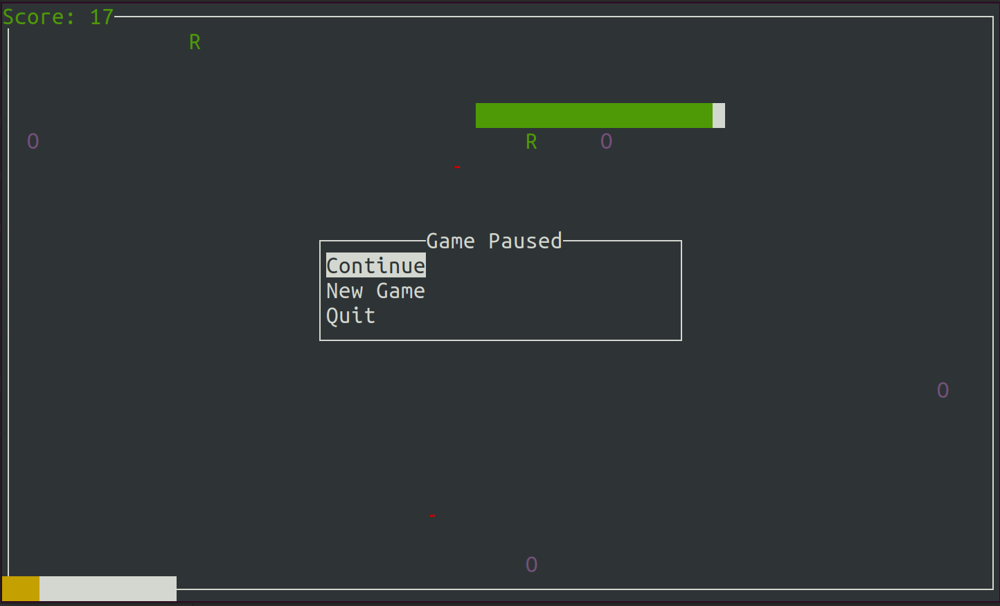

# snake
A Snake clone in C++ that uses `ncurses` library.

<div align="center"></div>

# Quickstart
* On Ubuntu-based systems
    ```
    $ ./snake
    ```

# Compiling
* On Ubuntu-based systems

    1. Install `ncurses` library.
        ```
        $ sudo apt install libncurses-dev
        ```

    2. Compile the program.
        ```
        $ make
        ```

    3. Run the program.
        ```
        $ ./snake
        ```

# Credits
* [ncurses](https://invisible-island.net/ncurses/ncurses.html)
